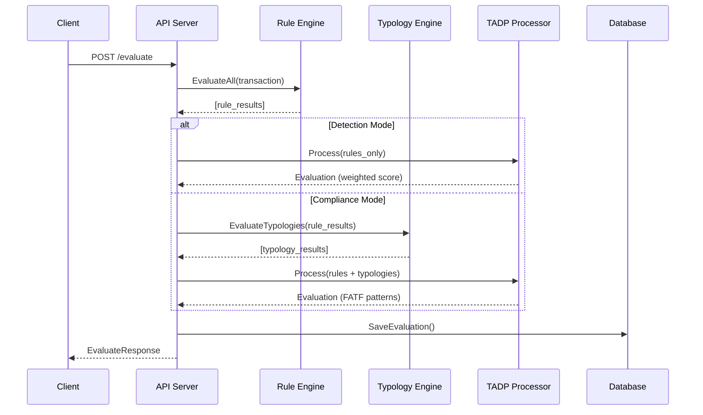

# Osprey Architecture

## Overview

Osprey is a **real-time fraud detection engine** designed for the API economy. It provides two evaluation modes to serve different market needs:

| Mode | Description | Target Users |
|------|-------------|--------------|
| **Detection** | Fast, weighted rule scoring | Product teams, startups, fraud analysts |
| **Compliance** | FATF-aligned typology evaluation | Banks, regulated fintechs, compliance teams |

```
┌─────────────────────────────────────────────────────────────────────────────┐
│                           OSPREY ARCHITECTURE                               │
└─────────────────────────────────────────────────────────────────────────────┘

  Transaction                                                        Alert/Pass
      │                                                                  ▲
      ▼                                                                  │
┌──────────┐    ┌──────────┐    ┌──────────────┐    ┌──────────┐    ┌───────┐
│  Ingest  │───▶│  Rules   │───▶│  Aggregation │───▶│   TADP   │───▶│ Alert │
│   API    │    │  Engine  │    │              │    │ Decision │    │Manager│
└──────────┘    └──────────┘    └──────────────┘    └──────────┘    └───────┘
                     │                 │
                     │           ┌─────┴─────┐
                     │           │           │
                     ▼           ▼           ▼
               Detection    Compliance    Compliance
                 Mode         Mode          Mode
              (default)   (typologies)   (FATF audit)
```

---

## Evaluation Modes

### Detection Mode (Default)

Fast, developer-friendly fraud detection without compliance overhead.

```
Transaction → Rules → Weighted Score → Threshold → Alert/Pass
```

**Characteristics:**
- No typologies required
- Sub-5ms evaluation latency
- Simple weighted rule aggregation
- Ideal for: fraud detection, startup MVPs, product teams

**When to use:**
- You need fast fraud detection
- You don't have regulatory typology requirements
- You want to start simple and upgrade later

### Compliance Mode

FATF-aligned evaluation with typologies for regulated entities.

```
Transaction → Rules → Typologies → FATF Patterns → Alert/Pass
                           │
                           ├── Account Takeover
                           ├── Structuring
                           ├── Mule Account
                           └── ... (FATF patterns)
```

**Characteristics:**
- Typologies required
- Full audit trails
- Pattern-based detection (FATF-aligned)
- Ideal for: banks, regulated fintechs, compliance teams

**When to use:**
- You have regulatory requirements (AML/CFT)
- You need FATF-aligned typologies
- You need full audit trails for SAR filing

---

## Mode Enforcement

The evaluation mode is enforced at multiple layers to ensure consistent behavior:

### Component Chain

```
main.go → Server → Handler → TADP Processor
              ↓
           Worker (async)
```

**Mode Propagation:**
1. `main.go` reads `OSPREY_MODE` environment variable
2. Mode is passed to `api.NewServer()` and `worker.NewWorker()`
3. Handler checks mode **before** evaluating typologies
4. TADP Processor uses mode to determine scoring strategy

### Handler Enforcement

```go
// Detection mode: Skip typology evaluation entirely
if h.mode == domain.ModeCompliance && h.typologyEngine != nil {
    typologyResults = h.typologyEngine.EvaluateTypologies(ruleResults)
}
```

**Key Behavior:**
- **Detection Mode**: Typology engine is never invoked (zero CPU overhead)
- **Compliance Mode**: Typologies are evaluated and used for alerting

### Health Endpoint

The `/health` endpoint reports the current mode for operational visibility:

```bash
curl http://localhost:8080/health
```

```json
{
  "status": "healthy",
  "version": "1.0.0",
  "mode": "detection"
}
```

---

## Transaction Flow



---

## Configuration

### Environment Variables

| Variable | Default | Description |
|----------|---------|-------------|
| `OSPREY_MODE` | `detection` | Evaluation mode: `detection` or `compliance` |
| `OSPREY_TIER` | `community` | Product tier: `community`, `pro`, `enterprise` |
| `OSPREY_DEBUG` | `false` | Enable debug logging |

### Starting in Detection Mode (Default)

```bash
# Detection mode is the default
./osprey

# Or explicitly
OSPREY_MODE=detection ./osprey
```

### Starting in Compliance Mode

```bash
# Requires typologies to be configured
OSPREY_MODE=compliance ./osprey
```

---

## Database-Driven Configuration

Rules and typologies are stored in the database and loaded at runtime.

### Rules Table

```sql
CREATE TABLE rule_configs (
    id TEXT NOT NULL,
    tenant_id TEXT NOT NULL,     -- "*" for global rules
    name TEXT NOT NULL,
    expression TEXT NOT NULL,    -- CEL expression
    bands TEXT,                  -- JSON array of bands
    weight REAL DEFAULT 1.0,
    enabled INTEGER DEFAULT 1,
    PRIMARY KEY (id, tenant_id, version)
);
```

### Typologies Table (Compliance Mode)

```sql
CREATE TABLE typologies (
    id TEXT NOT NULL,
    tenant_id TEXT NOT NULL,
    name TEXT NOT NULL,
    rules TEXT NOT NULL,         -- JSON array of {ruleId, weight}
    alert_threshold REAL DEFAULT 0.6,
    enabled INTEGER DEFAULT 1,
    PRIMARY KEY (id, tenant_id, version)
);
```

---

## API Endpoints

### Core (Both Modes)

| Method | Endpoint | Description |
|--------|----------|-------------|
| POST | `/evaluate` | Evaluate a transaction |
| GET | `/rules` | List all rules |
| POST | `/rules` | Create a new rule |
| POST | `/rules/reload` | Hot-reload rules |
| GET | `/health` | Health check |

### Compliance Mode Only

| Method | Endpoint | Description |
|--------|----------|-------------|
| GET | `/typologies` | List all typologies |
| POST | `/typologies` | Create a new typology |
| PUT | `/typologies/{id}` | Update a typology |
| DELETE | `/typologies/{id}` | Delete a typology |
| POST | `/typologies/reload` | Hot-reload typologies |

---

## Scoring

### Detection Mode Scoring

```
Final Score = Σ(rule_score × rule_weight) / Σ(rule_weight)

Alert if:
  - Final Score >= threshold (default 0.7), OR
  - Any rule returns .fail (critical failure)
```

### Compliance Mode Scoring

```
For each Typology:
  Typology Score = Σ(rule_score × typology_weight)

Alert if:
  - Any Typology Score >= typology_threshold, OR
  - Any rule returns .fail (critical failure)
```

---

## Comparison: Detection vs Compliance

| Aspect | Detection Mode | Compliance Mode |
|--------|---------------|-----------------|
| Typologies | Not required | Required |
| Evaluation | Weighted aggregate | Per-typology |
| Latency SLA | <5ms | <50ms |
| Audit depth | Basic | Full FATF |
| Target user | Product team | Compliance team |
| Complexity | Simple | Complex |

---

## Upgrade Path

```
┌─────────────────────────────────────────────────────────────────────────────┐
│                         OSPREY GROWTH PATH                                  │
└─────────────────────────────────────────────────────────────────────────────┘

  START HERE                    GROWTH                      SCALE
  ──────────                    ──────                      ─────

  Detection Mode                Detection Mode              Compliance Mode
  Community Tier                Pro Tier                    Enterprise Tier
  ───────────────────           ───────────────────         ───────────────────
  • 3 rules                     • Unlimited rules           • FATF typologies
  • SQLite                      • PostgreSQL/Redis          • Full audit trails
  • In-memory cache             • Two-phase cache           • SAR integration
  • Fraud detection             • Advanced fraud            • Regulatory reporting

  $0/month                      $99-499/month               Custom pricing
```

---

## Future Enhancements

1. **ML Integration** - Add ML scoring as additional signal in Detection mode
2. **Network Analysis** - Graph-based detection for mule networks
3. **Auto-reload** - Watch for database changes and auto-reload rules
4. **Rule Templates** - Pre-built rule packs for common fraud patterns
5. **SAR Export** - Automated Suspicious Activity Report generation (Compliance mode)
