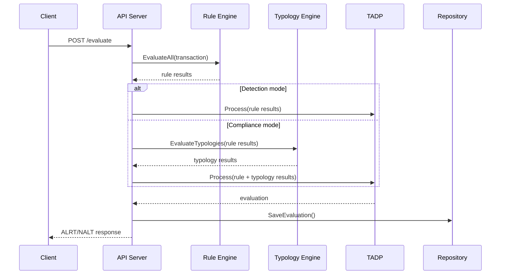

# Osprey Architecture

## Overview

Osprey is a real-time transaction monitoring engine with two evaluation modes:

| Mode | Description | Target Users |
|------|-------------|--------------|
| **Detection** | Weighted rule scoring | Product teams, fraud teams, startups |
| **Compliance** | Rule + typology evaluation | Regulated teams with AML/CFT workflows |

```
Transaction -> API Ingest -> Rule Engine -> TADP Decision -> Alert/Pass
                              |
                              +-> Typology Engine (compliance mode)
```

## Evaluation Modes

### Detection Mode

```
Transaction -> Rules -> Weighted Score -> Threshold -> ALRT/NALT
```

- Default mode
- Typologies are not required
- Decision uses rule aggregate score and `.fail` outcomes

### Compliance Mode

```
Transaction -> Rules -> Typologies -> Threshold -> ALRT/NALT
```

- Typologies are required for evaluation
- Typology triggers + rule critical failures determine alerts
- If typologies are not loaded:
- `POST /evaluate` returns `503`
- `GET /health` returns `status: "degraded"`
- `GET /ready` returns `503`

## Mode Enforcement

Mode is propagated from startup config through server, handler, worker, and TADP processor:

1. `cmd/osprey/main.go` reads `OSPREY_MODE`
2. mode is injected into API server + worker
3. handler/worker enforce compliance typology readiness before evaluation
4. TADP applies detection/compliance scoring strategy

## Runtime Profiles

| Profile | Enabled With | Defaults |
|---------|---------------|----------|
| **Community** | default / `OSPREY_TIER=community` | SQLite + memory cache + channel bus |
| **Pro profile** | `OSPREY_TIER=pro` | PostgreSQL + Redis + NATS |

`OSPREY_TIER=enterprise` is currently unsupported in this open-source build and falls back to community defaults.

## Transaction Flow



## Configuration

### Environment Variables

| Variable | Default | Description |
|----------|---------|-------------|
| `OSPREY_MODE` | `detection` | `detection` or `compliance` |
| `OSPREY_TIER` | `community` | runtime profile: `community` or `pro` |
| `OSPREY_DEBUG` | `false` | debug logging |
| `OSPREY_DB_DRIVER` | `sqlite` | `sqlite` or `postgres` |
| `OSPREY_CACHE_TYPE` | `memory` | `memory` or `redis` |
| `OSPREY_BUS_TYPE` | `channel` | `channel` or `nats` |

## Database-Driven Config

Rules and typologies are loaded from the database at startup and via reload endpoints.

### `rule_configs`

```sql
CREATE TABLE rule_configs (
    id TEXT NOT NULL,
    tenant_id TEXT NOT NULL,
    name TEXT NOT NULL,
    description TEXT,
    version TEXT NOT NULL,
    expression TEXT NOT NULL,
    bands TEXT NOT NULL,
    weight REAL NOT NULL DEFAULT 1.0,
    enabled INTEGER NOT NULL DEFAULT 1,
    created_at TIMESTAMP NOT NULL,
    updated_at TIMESTAMP NOT NULL,
    PRIMARY KEY (id, tenant_id, version)
);
```

### `typologies`

```sql
CREATE TABLE typologies (
    id TEXT NOT NULL,
    tenant_id TEXT NOT NULL,
    name TEXT NOT NULL,
    description TEXT,
    version TEXT NOT NULL,
    rules TEXT NOT NULL,
    alert_threshold REAL NOT NULL DEFAULT 0.6,
    enabled INTEGER NOT NULL DEFAULT 1,
    created_at TIMESTAMP NOT NULL,
    updated_at TIMESTAMP NOT NULL,
    PRIMARY KEY (id, tenant_id, version)
);
```

## API Surface

### Core Endpoints

| Method | Endpoint | Notes |
|--------|----------|-------|
| POST | `/evaluate` | compliance requires loaded typologies |
| GET | `/rules` | loaded rules |
| POST | `/rules` | persists rule config (reload to apply) |
| POST | `/rules/reload` | hot reload rules |
| GET | `/health` | readiness signal + mode |
| GET | `/ready` | traffic readiness gate |

### Typology Endpoints

| Method | Endpoint |
|--------|----------|
| GET | `/typologies` |
| POST | `/typologies` |
| PUT | `/typologies/{id}` |
| DELETE | `/typologies/{id}` |
| POST | `/typologies/reload` |

## Scoring

### Detection

```
score = Σ(rule_score * rule_weight) / Σ(rule_weight)
alert if score >= threshold OR any rule returns .fail
```

### Compliance

```
typology_score = Σ(rule_score * typology_rule_weight)
alert if any typology is triggered OR any rule returns .fail
```

## Future Work

1. ML risk signals
2. Network/graph analytics
3. Automated SAR export
4. Enhanced rule/typology lifecycle tooling
