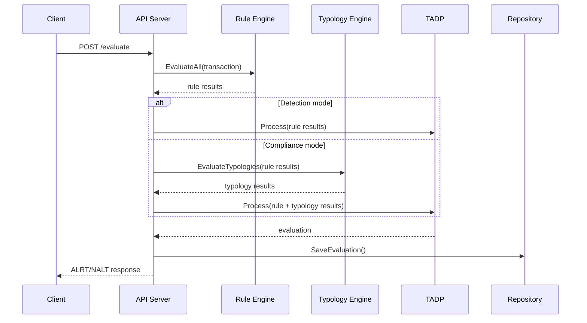

# Osprey Architecture

## Overview

Osprey is a real-time transaction monitoring engine with two evaluation modes:

| Mode | Description |
|------|-------------|
| **Detection** | Weighted rule scoring. |
| **Compliance** | Rule and typology evaluation. |

```
Transaction -> API Ingest -> Rule Engine -> TADP Decision -> Alert/Pass
                              |
                              +-> Typology Engine (compliance mode)
```

## Evaluation Modes

### Detection Mode

```
Transaction -> Rules -> Weighted Score -> Threshold -> ALRT/NALT
```

- Default mode
- Typologies are not required
- Decision uses rule aggregate score and `.fail` outcomes

### Compliance Mode

```
Transaction -> Rules -> Typologies -> Threshold -> ALRT/NALT
```

- Typologies are required for evaluation
- Typology triggers + rule critical failures determine alerts
- If typologies are not loaded:
  - `POST /evaluate` returns `503`
  - `GET /health` returns `status: "degraded"`
  - `GET /ready` returns `503`

## Mode Enforcement

Mode is propagated from startup config through server, handler, worker, and TADP processor:

1. `cmd/osprey/main.go` reads `OSPREY_MODE`
2. mode is injected into API server + worker
3. handler/worker enforce compliance typology readiness before evaluation
4. TADP applies detection/compliance scoring strategy

## Runtime Profiles

| Profile | Enabled With | Defaults |
|---------|---------------|----------|
| **Community** | default / `OSPREY_TIER=community` | SQLite + memory cache + channel bus |
| **Pro profile** | `OSPREY_TIER=pro` | PostgreSQL + Redis + NATS |

`OSPREY_TIER=enterprise` is not enabled in this open-source build and falls back to community defaults.

## Transaction Flow


```mermaid
sequenceDiagram
    participant C as Client
    participant API as API Server
    participant R as Rule Engine
    participant T as Typology Engine
    participant P as TADP
    participant DB as Repository

    C->>API: POST /evaluate
    API->>R: EvaluateAll(transaction)
    R-->>API: rule results

    alt Detection mode
        API->>P: Process(rule results)
    else Compliance mode
        API->>T: EvaluateTypologies(rule results)
        T-->>API: typology results
        API->>P: Process(rule + typology results)
    end

    P-->>API: evaluation
    API->>DB: SaveEvaluation()
    API-->>C: ALRT/NALT response
```

## Configuration

### Environment Variables

Core:

| Variable | Default | Description |
|----------|---------|-------------|
| `OSPREY_ADMIN_TOKEN` | _(required)_ | Required to start. Protects rule and typology writes. |
| `OSPREY_MODE` | `detection` | `detection` or `compliance` |
| `OSPREY_TIER` | `community` | runtime profile: `community` or `pro` |
| `OSPREY_DEBUG` | `false` | debug logging |
| `OSPREY_HOST` | `0.0.0.0` | bind address |
| `OSPREY_PORT` | `8080` | HTTP port |
| `OSPREY_DB_DRIVER` | `sqlite` | `sqlite` or `postgres` |
| `OSPREY_SQLITE_PATH` | `./osprey.db` | SQLite file path (sqlite driver) |
| `OSPREY_CACHE_TYPE` | `memory` | `memory` or `redis` |
| `OSPREY_BUS_TYPE` | `channel` | `channel` or `nats` |
| `OSPREY_TENANTS` | _(unset)_ | comma-separated tenant IDs for async workers |
| `OSPREY_ASYNC_WORKER` | `false` | `true` enables async workers (always on in Pro tier) |
| `OSPREY_RATE_LIMIT_RPS` | `0` | per-tenant requests/second; `0` disables rate limiting |
| `OSPREY_RATE_LIMIT_BURST` | `= RPS` | per-tenant burst size |

Pro tier backends (used when `OSPREY_TIER=pro`, or when the matching driver/type is selected). Defaults shown are the in-process defaults; override per deployment:

| Variable | Default | Description |
|----------|---------|-------------|
| `OSPREY_POSTGRES_HOST` | `localhost` | PostgreSQL host |
| `OSPREY_POSTGRES_PORT` | `5432` | PostgreSQL port |
| `OSPREY_POSTGRES_USER` | _(unset)_ | PostgreSQL user |
| `OSPREY_POSTGRES_PASSWORD` | _(unset)_ | PostgreSQL password |
| `OSPREY_POSTGRES_DB` | `osprey` | PostgreSQL database name |
| `OSPREY_POSTGRES_SSLMODE` | _(unset)_ | `disable`, `require`, etc. |
| `OSPREY_REDIS_ADDR` | `localhost:6379` | Redis address |
| `OSPREY_REDIS_PASSWORD` | _(unset)_ | Redis password |
| `OSPREY_REDIS_DB` | `0` | Redis logical database |
| `OSPREY_NATS_URL` | `nats://localhost:4222` | NATS server URL |

## Database-Driven Config

Rules and typologies are loaded from the database at startup. Writes through `POST /rules`, `POST /typologies`, `PUT`/`DELETE /typologies/{id}` persist to the database and apply to the running engine immediately. The reload endpoints re-read the database into the engine after out-of-band changes (for example, a direct database edit).

### `rule_configs`

```sql
CREATE TABLE rule_configs (
    id TEXT NOT NULL,
    tenant_id TEXT NOT NULL,
    name TEXT NOT NULL,
    description TEXT,
    version TEXT NOT NULL,
    expression TEXT NOT NULL,
    bands TEXT NOT NULL,
    weight REAL NOT NULL DEFAULT 1.0,
    enabled INTEGER NOT NULL DEFAULT 1,
    created_at TIMESTAMP NOT NULL,
    updated_at TIMESTAMP NOT NULL,
    PRIMARY KEY (id, tenant_id, version)
);
```

### `typologies`

```sql
CREATE TABLE typologies (
    id TEXT NOT NULL,
    tenant_id TEXT NOT NULL,
    name TEXT NOT NULL,
    description TEXT,
    version TEXT NOT NULL,
    rules TEXT NOT NULL,
    alert_threshold REAL NOT NULL DEFAULT 0.6,
    enabled INTEGER NOT NULL DEFAULT 1,
    created_at TIMESTAMP NOT NULL,
    updated_at TIMESTAMP NOT NULL,
    PRIMARY KEY (id, tenant_id, version)
);
```

## API Surface

### Core Endpoints

| Method | Endpoint | Notes |
|--------|----------|-------|
| POST | `/evaluate` | compliance requires loaded typologies |
| GET | `/rules` | loaded rules |
| GET | `/rules/{id}` | fetch a single rule |
| POST | `/rules` | create or update a rule; applied immediately |
| PUT | `/rules/{id}` | update a rule; applied immediately |
| DELETE | `/rules/{id}` | disable a rule; `409` if referenced by a loaded typology |
| POST | `/rules/reload` | re-read rules from storage (after out-of-band changes) |
| GET | `/health` | readiness signal + mode |
| GET | `/ready` | traffic readiness gate |

### Typology Endpoints

| Method | Endpoint |
|--------|----------|
| GET | `/typologies` |
| GET | `/typologies/{id}` |
| POST | `/typologies` |
| PUT | `/typologies/{id}` |
| DELETE | `/typologies/{id}` |
| POST | `/typologies/reload` |

Retrieval endpoints `GET /evaluations/{id}` and `GET /transactions/{id}` are documented in the [Sandbox and API guide](SANDBOX.md). The full contract is in [`api/openapi.yaml`](api/openapi.yaml).

## Scoring

### Detection

```
score = sum(rule_score * rule_weight) / sum(rule_weight)
alert if score >= threshold OR any rule returns .fail
```

### Compliance

```
typology_score = sum(rule_score * typology_rule_weight)
alert if any typology is triggered OR any rule returns .fail
```

## Extensibility

Common extension points are new CEL variables, new repository backends, richer rule lifecycle tooling, and additional typology packs.
