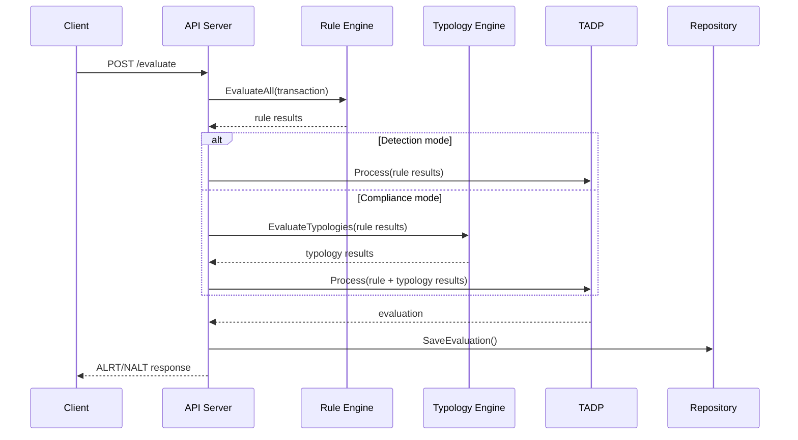

# Osprey Architecture

## Overview

Osprey is a real-time transaction monitoring engine.
It has two evaluation modes:

| Mode | Description |
|------|-------------|
| **Detection** | Osprey calculates a weighted score from the rules. |
| **Compliance** | Osprey evaluates the rules and the typologies. |

```
Transaction -> API Ingest -> Rule Engine -> TADP Decision -> Alert/Pass
                              |
                              +-> Typology Engine (compliance mode)
```

## Evaluation Modes

### Detection Mode

```
Transaction -> Rules -> Weighted Score -> Threshold -> ALRT/NALT
```

- Detection is the default mode.
- Detection mode does not require typologies.
- The decision uses the aggregate score of the rules and the `.fail` outcomes.

### Compliance Mode

```
Transaction -> Rules -> Typologies -> Threshold -> ALRT/NALT
```

- Compliance mode requires typologies for each evaluation.
- Typology triggers and critical rule failures cause alerts.
- If Osprey did not load the typologies, the endpoints give these results:
  - `POST /evaluate` returns `503`
  - `GET /health` returns `status: "degraded"`
  - `GET /ready` returns `503`

## Mode Enforcement

Osprey sends the mode from the startup configuration to these components:

- The server
- The handler
- The worker
- The TADP processor

The sequence is:

1. `cmd/osprey/main.go` reads `OSPREY_MODE`.
2. Osprey gives the mode to the API server and to the worker.
3. The handler and the worker make sure that compliance typologies are ready before each evaluation.
4. TADP applies the scoring strategy for detection mode or compliance mode.

## Runtime Profiles

| Profile | Enabled With | Defaults |
|---------|---------------|----------|
| **Community** | Default, or `OSPREY_TIER=community` | SQLite, memory cache, and channel bus |
| **Pro profile** | `OSPREY_TIER=pro` | PostgreSQL, Redis, and NATS |

This open-source build does not enable `OSPREY_TIER=enterprise`.
If you set `OSPREY_TIER=enterprise`, Osprey uses the community defaults.

## Transaction Flow


```mermaid
sequenceDiagram
    participant C as Client
    participant API as API Server
    participant R as Rule Engine
    participant T as Typology Engine
    participant P as TADP
    participant DB as Repository

    C->>API: POST /evaluate
    API->>R: EvaluateAll(transaction)
    R-->>API: rule results

    alt Detection mode
        API->>P: Process(rule results)
    else Compliance mode
        API->>T: EvaluateTypologies(rule results)
        T-->>API: typology results
        API->>P: Process(rule + typology results)
    end

    P-->>API: evaluation
    API->>DB: SaveEvaluation()
    API-->>C: ALRT/NALT response
```

## Configuration

### Environment Variables

Core variables:

| Variable | Default | Description |
|----------|---------|-------------|
| `OSPREY_ADMIN_TOKEN` | _(required)_ | Osprey does not start without it. It protects the rule and typology writes. |
| `OSPREY_MODE` | `detection` | `detection` or `compliance` |
| `OSPREY_TIER` | `community` | Runtime profile: `community` or `pro` |
| `OSPREY_DEBUG` | `false` | Debug logs |
| `OSPREY_HOST` | `0.0.0.0` | Bind address |
| `OSPREY_PORT` | `8080` | HTTP port |
| `OSPREY_DB_DRIVER` | `sqlite` | `sqlite` or `postgres` |
| `OSPREY_SQLITE_PATH` | `./osprey.db` | SQLite file path (sqlite driver) |
| `OSPREY_CACHE_TYPE` | `memory` | `memory` or `redis` |
| `OSPREY_BUS_TYPE` | `channel` | `channel` or `nats` |
| `OSPREY_TENANTS` | _(unset)_ | Comma-separated tenant IDs for the async workers |
| `OSPREY_ASYNC_WORKER` | `false` | `true` enables the async workers. The Pro tier always enables them. |
| `OSPREY_RATE_LIMIT_RPS` | `0` | Requests per second for each tenant. `0` disables the rate limit. |
| `OSPREY_RATE_LIMIT_BURST` | `= RPS` | Burst size for each tenant |

Pro tier backends:

- Osprey uses these variables when `OSPREY_TIER=pro`.
- Osprey also uses them when you select the related database driver, cache type, or bus type.
- The table shows the in-process defaults.
- Override the defaults for each deployment.

| Variable | Default | Description |
|----------|---------|-------------|
| `OSPREY_POSTGRES_HOST` | `localhost` | PostgreSQL host |
| `OSPREY_POSTGRES_PORT` | `5432` | PostgreSQL port |
| `OSPREY_POSTGRES_USER` | _(unset)_ | PostgreSQL user |
| `OSPREY_POSTGRES_PASSWORD` | _(unset)_ | PostgreSQL password |
| `OSPREY_POSTGRES_DB` | `osprey` | PostgreSQL database name |
| `OSPREY_POSTGRES_SSLMODE` | _(unset)_ | SSL mode, for example `disable` or `require` |
| `OSPREY_REDIS_ADDR` | `localhost:6379` | Redis address |
| `OSPREY_REDIS_PASSWORD` | _(unset)_ | Redis password |
| `OSPREY_REDIS_DB` | `0` | Redis logical database |
| `OSPREY_NATS_URL` | `nats://localhost:4222` | NATS server URL |

## Database-Driven Config

At startup, Osprey loads the rules and the typologies from the database.

These write endpoints save the change to the database:

- `POST /rules`
- `POST /typologies`
- `PUT /typologies/{id}`
- `DELETE /typologies/{id}`

The engine also applies each of these changes immediately, while it runs.

The reload endpoints read the database into the engine again.
Use them after a change outside the API, for example a direct database edit.

### `rule_configs`

```sql
CREATE TABLE rule_configs (
    id TEXT NOT NULL,
    tenant_id TEXT NOT NULL,
    name TEXT NOT NULL,
    description TEXT,
    version TEXT NOT NULL,
    expression TEXT NOT NULL,
    bands TEXT NOT NULL,
    weight REAL NOT NULL DEFAULT 1.0,
    enabled INTEGER NOT NULL DEFAULT 1,
    created_at TIMESTAMP NOT NULL,
    updated_at TIMESTAMP NOT NULL,
    PRIMARY KEY (id, tenant_id, version)
);
```

### `typologies`

```sql
CREATE TABLE typologies (
    id TEXT NOT NULL,
    tenant_id TEXT NOT NULL,
    name TEXT NOT NULL,
    description TEXT,
    version TEXT NOT NULL,
    rules TEXT NOT NULL,
    alert_threshold REAL NOT NULL DEFAULT 0.6,
    enabled INTEGER NOT NULL DEFAULT 1,
    created_at TIMESTAMP NOT NULL,
    updated_at TIMESTAMP NOT NULL,
    PRIMARY KEY (id, tenant_id, version)
);
```

## API Surface

### Core Endpoints

| Method | Endpoint | Notes |
|--------|----------|-------|
| POST | `/evaluate` | Compliance mode requires loaded typologies. |
| GET | `/rules` | Returns the loaded rules. |
| GET | `/rules/{id}` | Returns one rule. |
| POST | `/rules` | Creates or updates a rule. The engine applies it immediately. |
| PUT | `/rules/{id}` | Updates a rule. The engine applies it immediately. |
| DELETE | `/rules/{id}` | Disables a rule. Returns `409` if a loaded typology refers to the rule. |
| POST | `/rules/reload` | Reads the rules from storage again, after a change outside the API. |
| GET | `/health` | Returns the readiness signal and the mode. |
| GET | `/ready` | Readiness gate for traffic. |

### Typology Endpoints

| Method | Endpoint |
|--------|----------|
| GET | `/typologies` |
| GET | `/typologies/{id}` |
| POST | `/typologies` |
| PUT | `/typologies/{id}` |
| DELETE | `/typologies/{id}` |
| POST | `/typologies/reload` |

The [Sandbox and API guide](SANDBOX.md) describes the retrieval endpoints `GET /evaluations/{id}` and `GET /transactions/{id}`.
The full contract is in [`api/openapi.yaml`](api/openapi.yaml).

## Scoring

### Detection

```
score = sum(rule_score * rule_weight) / sum(rule_weight)
alert if score >= threshold OR any rule returns .fail
```

### Compliance

```
typology_score = sum(rule_score * typology_rule_weight)
alert if any typology is triggered OR any rule returns .fail
```

## Extensibility

These are the common extension points:

- New CEL variables
- New repository backends
- Better tools for the rule lifecycle
- More typology packs
