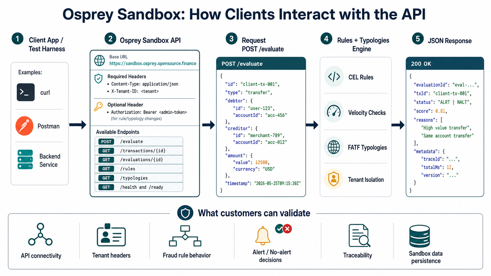

# Sandbox and API Guide

Use this guide to:

1. deploy a local Osprey sandbox with Docker, or
2. call an existing sandbox URL supplied by its operator.

Osprey does not currently provide a maintained public sandbox URL. To use a
remote deployment, obtain its base URL and, for configuration writes, its admin
token from the operator.

## Prerequisites

For a local Docker sandbox, install:

- Git
- Docker with a running Docker daemon
- `curl`
- OpenSSL, used below to generate an admin token

The API examples are self-contained and work from any directory. The automated
verification scripts require a repository clone and additional tools described
in [Sandbox Assurance](ASSURANCE.md).

## Deploy a Local Docker Sandbox

### 1. Clone the repository

```bash
git clone https://github.com/opensource-finance/osprey.git
cd osprey
```

Run the remaining deployment and verification commands from the repository
root.

### 2. Configure the sandbox

```bash
export OSPREY_HOST_PORT=8080
export OSPREY_ADMIN_TOKEN="$(openssl rand -hex 32)"
```

`OSPREY_HOST_PORT` must be unused. If port `8080` is already occupied, choose
another host port, such as `18080`. Osprey still listens on port `8080` inside
the container.

Keep `OSPREY_ADMIN_TOKEN` private. Anyone who has it can replace the active rule
and typology configuration for every tenant.

### 3. Build and run Osprey

```bash
docker build -t osprey-sandbox:local .
docker volume create osprey-sandbox-data

docker run -d \
  --name osprey-sandbox \
  -p "${OSPREY_HOST_PORT}:8080" \
  -e OSPREY_MODE=detection \
  -e OSPREY_TIER=community \
  -e OSPREY_DB_DRIVER=sqlite \
  -e OSPREY_SQLITE_PATH=/app/data/osprey.db \
  -e OSPREY_ADMIN_TOKEN="$OSPREY_ADMIN_TOKEN" \
  -e OSPREY_RATE_LIMIT_RPS=50 \
  -v osprey-sandbox-data:/app/data \
  osprey-sandbox:local
```

The named Docker volume persists rules, typologies, transactions, and
evaluations across container restarts.

Leave `OSPREY_RATE_LIMIT_RPS` unset for load testing. For a shared sandbox, set
an appropriate per-tenant request limit before exposing it publicly.

### 4. Check the deployment

```bash
export OSPREY_URL="http://localhost:$OSPREY_HOST_PORT"
export TENANT_ID=demo

curl --fail-with-body --silent --show-error "$OSPREY_URL/health"
curl --fail-with-body --silent --show-error "$OSPREY_URL/ready"
```

In detection mode, both endpoints should return HTTP `200`. In compliance mode,
`/ready` returns `503` until typologies are loaded.

Useful lifecycle commands:

```bash
docker logs osprey-sandbox
docker stop osprey-sandbox
docker start osprey-sandbox
```

To remove the container while preserving its data:

```bash
docker rm -f osprey-sandbox
```

`docker volume rm osprey-sandbox-data` permanently deletes the sandbox data.

## Connect to an Existing Sandbox

Set the URL and a tenant identifier supplied or approved by the operator:

```bash
export OSPREY_URL=https://your-osprey-host.example
export TENANT_ID=demo
```

To create, update, delete, or reload rules and typologies, also set the admin
token supplied by the operator:

```bash
export OSPREY_ADMIN_TOKEN=replace-with-operator-provided-token
```

Evaluation and read requests do not require the admin token.

## Request and Configuration Scope

Every tenant-scoped request needs:

```http
X-Tenant-ID: <tenant-id>
```

JSON requests also need:

```http
Content-Type: application/json
```

Configuration writes accept either admin-token header:

```http
Authorization: Bearer <admin-token>
```

```http
X-Osprey-Admin-Token: <admin-token>
```

Transactions and evaluations are isolated by `X-Tenant-ID`. Rules and
typologies are different: they are global active-engine configuration. The
server stores them with response field `tenantId: "*"`, and a successful write
affects evaluations for every tenant. The tenant header is still required on
configuration endpoints for request validation, rate limiting, and audit logs.

## API Flow

1. Check `/health` and `/ready`.
2. Send a transaction to `POST /evaluate`.
3. Add rules with `POST /rules` if you have the admin token.
4. In compliance mode, add typologies with `POST /typologies`.
5. Use `evaluationId` and `txId` to fetch stored records.



## Health

```bash
curl --fail-with-body --silent --show-error "$OSPREY_URL/health"
curl --fail-with-body --silent --show-error "$OSPREY_URL/ready"
```

## Evaluate a Transaction

The generated transaction ID makes this example safe to repeat:

```bash
export NORMAL_TX_ID="sandbox-normal-$(date +%s)"

curl --fail-with-body --silent --show-error \
  -X POST "$OSPREY_URL/evaluate" \
  -H "Content-Type: application/json" \
  -H "X-Tenant-ID: $TENANT_ID" \
  --data-binary @- <<JSON
{
  "id": "$NORMAL_TX_ID",
  "type": "TRANSFER",
  "debtor": {"id": "user-a", "accountId": "acct-a"},
  "creditor": {"id": "merchant-b", "accountId": "acct-b"},
  "amount": {"value": 125, "currency": "USD"},
  "timestamp": "2026-05-25T09:15:30Z"
}
JSON
```

Decision values:

| Status | Meaning |
|--------|---------|
| `NALT` | No alert. |
| `ALRT` | Alert. |

Important response fields include `evaluationId`, `txId`, `status`, `score`,
`reasons`, and `metadata.traceId`.

## Fetch Stored Records

Copy the IDs from the evaluation response:

```bash
curl --fail-with-body --silent --show-error \
  "$OSPREY_URL/evaluations/<evaluation-id>" \
  -H "X-Tenant-ID: $TENANT_ID"

curl --fail-with-body --silent --show-error \
  "$OSPREY_URL/transactions/<transaction-id>" \
  -H "X-Tenant-ID: $TENANT_ID"
```

Transaction IDs are unique per tenant. Reusing an ID in the same tenant returns
`409 Conflict`; the same ID may be used by a different tenant.

## Create a Rule

This operation requires `OSPREY_ADMIN_TOKEN` and changes the global active
configuration.

```bash
curl --fail-with-body --silent --show-error \
  -X POST "$OSPREY_URL/rules" \
  -H "Content-Type: application/json" \
  -H "X-Tenant-ID: $TENANT_ID" \
  -H "Authorization: Bearer $OSPREY_ADMIN_TOKEN" \
  --data-binary @- <<'JSON'
{
  "id": "sandbox-verification-same-party",
  "name": "Sandbox Verification Same Party",
  "description": "Detects same-entity transfers.",
  "expression": "debtor_id == creditor_id",
  "weight": 1,
  "enabled": true,
  "bands": [
    {
      "lowerLimit": 1,
      "subRuleRef": ".fail",
      "reason": "Same party transfer detected"
    },
    {
      "lowerLimit": 0,
      "upperLimit": 1,
      "subRuleRef": ".pass",
      "reason": "Different parties"
    }
  ]
}
JSON
```

Rule request fields:

| Field | Required | Notes |
|-------|----------|-------|
| `id` | Yes | Stable machine-readable ID. |
| `name` | Yes | Human-readable name. |
| `description` | No | Purpose of the rule. |
| `expression` | Yes | CEL expression. |
| `weight` | Yes | Number from `0` to `1`. |
| `enabled` | Yes | Disabled rules are stored but not active. |
| `bands` | No | Reasons for score ranges. |

The response also contains server-assigned `tenantId: "*"` and `version`
fields. Do not send either field in the request.

Common CEL variables:

| Variable | Source |
|----------|--------|
| `amount` | `amount.value` |
| `currency` | `amount.currency`, uppercase |
| `tx_type` | `type`, uppercase |
| `debtor_id` | `debtor.id` |
| `creditor_id` | `creditor.id` |
| `old_balance` | `metadata.old_balance` |
| `new_balance` | `metadata.new_balance` |
| `velocity_count` | Recent transaction count for the entity |

See [Rule and Typology Authoring](RULE_TYPOLOGY_AUTHORING.md) for the complete
variable list and authoring guidance.

## Trigger the Rule

```bash
export ALERT_TX_ID="sandbox-alert-$(date +%s)"

curl --fail-with-body --silent --show-error \
  -X POST "$OSPREY_URL/evaluate" \
  -H "Content-Type: application/json" \
  -H "X-Tenant-ID: $TENANT_ID" \
  --data-binary @- <<JSON
{
  "id": "$ALERT_TX_ID",
  "type": "TRANSFER",
  "debtor": {"id": "user-alert", "accountId": "acct-alert-a"},
  "creditor": {"id": "user-alert", "accountId": "acct-alert-b"},
  "amount": {"value": 125, "currency": "USD"},
  "timestamp": "2026-05-25T09:16:30Z"
}
JSON
```

The expected decision is `ALRT` with reason `Same party transfer detected`.

## Update a Rule

The URL ID is authoritative for updates, so the request body does not need an
`id` field:

```bash
curl --fail-with-body --silent --show-error \
  -X PUT "$OSPREY_URL/rules/sandbox-verification-same-party" \
  -H "Content-Type: application/json" \
  -H "X-Tenant-ID: $TENANT_ID" \
  -H "Authorization: Bearer $OSPREY_ADMIN_TOKEN" \
  --data-binary @- <<'JSON'
{
  "name": "Sandbox Verification Same Party",
  "description": "Detects same-entity transfers.",
  "expression": "debtor_id == creditor_id",
  "weight": 1,
  "enabled": true,
  "bands": [
    {
      "lowerLimit": 1,
      "subRuleRef": ".fail",
      "reason": "Same party transfer detected"
    },
    {
      "lowerLimit": 0,
      "upperLimit": 1,
      "subRuleRef": ".pass",
      "reason": "Different parties"
    }
  ]
}
JSON
```

Writes apply to the active engine immediately.

## Create a Typology

Typologies affect decisions only in compliance mode. This global configuration
write requires the admin token, and every `ruleId` must already appear in
`GET /rules`.

```bash
curl --fail-with-body --silent --show-error \
  -X POST "$OSPREY_URL/typologies" \
  -H "Content-Type: application/json" \
  -H "X-Tenant-ID: $TENANT_ID" \
  -H "Authorization: Bearer $OSPREY_ADMIN_TOKEN" \
  --data-binary @- <<'JSON'
{
  "id": "sandbox-verification-typology",
  "name": "Sandbox Verification Typology",
  "description": "Groups the sample same-party rule.",
  "alertThreshold": 0.5,
  "enabled": true,
  "rules": [
    {"ruleId": "sandbox-verification-same-party", "weight": 1}
  ]
}
JSON
```

## Read Active Configuration

```bash
curl --fail-with-body --silent --show-error \
  "$OSPREY_URL/rules" \
  -H "X-Tenant-ID: $TENANT_ID"

curl --fail-with-body --silent --show-error \
  "$OSPREY_URL/typologies" \
  -H "X-Tenant-ID: $TENANT_ID"
```

These endpoints return global active-engine state.

## Remove the Sample Configuration

Delete the typology before its referenced rule:

```bash
curl --fail-with-body --silent --show-error \
  -X DELETE "$OSPREY_URL/typologies/sandbox-verification-typology" \
  -H "X-Tenant-ID: $TENANT_ID" \
  -H "Authorization: Bearer $OSPREY_ADMIN_TOKEN"

curl --fail-with-body --silent --show-error \
  -X DELETE "$OSPREY_URL/rules/sandbox-verification-same-party" \
  -H "X-Tenant-ID: $TENANT_ID" \
  -H "Authorization: Bearer $OSPREY_ADMIN_TOKEN"
```

Deleting a rule still referenced by a loaded typology returns `409 Conflict`.

## Verify Before Sharing a URL

Run the automated commands from a repository clone. The full assurance gate
requires `curl`, Go 1.26 or later, `jq`, Ruby, and Docker:

```bash
OSPREY_TEST_PORT=18080 \
DOCKER_PORT=18081 \
./scripts/assure-sandbox.sh
```

Both ports must be unused. The integration runner now refuses an occupied health
port instead of testing whichever service already owns it.

The public URL verifier is intentionally mutating. It creates or replaces the
global rules `sandbox-verification-same-party` and
`sandbox-verification-typology`, submits transactions, and checks a second
tenant. Run it only against a disposable sandbox or a deployment whose operator
has approved those changes.

```bash
OSPREY_URL=https://your-osprey-host.example \
TENANT_ID=demo \
OSPREY_ADMIN_TOKEN=replace-with-admin-token \
EXPECTED_STATUS=healthy \
EXPECTED_MODE=detection \
./scripts/verify-sandbox.sh
```

`OSPREY_URL` is required. The verifier has no implicit hosted target.

## Errors

| Status | Common Cause |
|--------|--------------|
| `400` | Missing tenant header, invalid JSON, invalid rule or typology. |
| `401` | Missing or invalid admin token on a write endpoint. |
| `404` | Record not found. |
| `409` | Duplicate transaction ID, or deleting a referenced rule. |
| `413` | JSON body is too large. |
| `429` | Per-tenant rate limit exceeded when rate limiting is enabled. |
| `500` | Persistence or evaluation error. |
| `503` | Repository unavailable, or compliance mode is missing typologies. |
