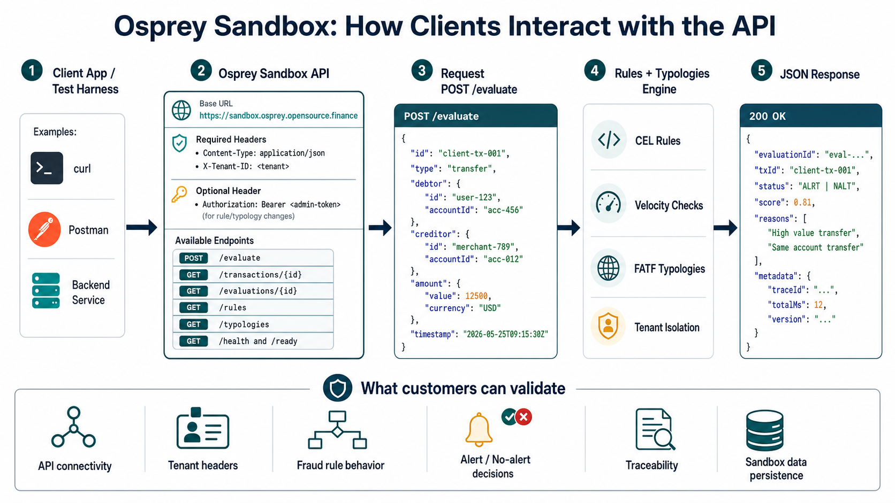

# Sandbox and API Guide

Use this guide for one of these tasks:

1. Deploy a local Osprey sandbox with Docker.
2. Call a sandbox URL that its owner gives you.

At this time, Osprey does not supply a maintained public sandbox URL.
To use a remote sandbox, ask its owner for the base URL.
To change rules or typologies, you also need the admin token.

## Deploy with an AI Agent

Copy this prompt into an AI coding agent that can run shell commands:

```text
Set up an Osprey sandbox on my computer.

Use this guide as the source of truth:
https://github.com/opensource-finance/osprey/blob/main/docs/SANDBOX.md

Rules:
1. Read the current guide before running commands.
2. Create a local Docker sandbox only. Do not expose it to the public internet.
3. Check for Git, Docker, curl, and OpenSSL first. Check that Docker is running.
   If something is missing, stop and tell me what I need to install or start.
4. Use a new clone of https://github.com/opensource-finance/osprey.git. If the
   target folder already exists, ask before using or changing it.
5. Before creating Docker resources, check whether the container name, volume
   name, image name, or host port is already in use. Do not delete or replace
   existing resources. Ask me what to do if there is a name conflict.
6. Follow the "Deploy a Local Docker Sandbox" section. If port 8080 is busy,
   choose an unused local port. Bind the service to 127.0.0.1 only.
7. Generate a new admin token. Save it in .env.sandbox.local as the guide says.
   Never print the token in chat, logs, command output, or the final report.
8. Do not edit Osprey source files, delete data, or push anything to Git.
9. Verify /health and /ready. Then run the guide's normal transaction, create
   the sample rule, and run the alert transaction. Do not claim success unless
   all checks pass.
10. If a command fails, stop, keep useful logs, and explain the exact failure in
    plain English. Do not hide the error or use an unsafe workaround.
11. At the end, report the local URL, container name, volume name, settings file
    path, and test results. Include the commands to stop and start the sandbox.
    Do not include the admin token.
```

The prompt points to this guide. It does not copy the commands from the guide.
Thus, there is only one installation procedure, and the prompt does not become out of date.

## Prerequisites

For a local Docker sandbox, install these items:

- Git
- Docker, with the Docker daemon on
- `curl`
- OpenSSL, to make an admin token in step 2

The API examples contain all the data that they need.
You can run them from any directory.
The automatic verification scripts need a clone of the repository.
They also need more tools.
[Sandbox Assurance](ASSURANCE.md) gives the list of these tools.

## Deploy a Local Docker Sandbox

### 1. Clone the repository

```bash
git clone https://github.com/opensource-finance/osprey.git
cd osprey
```

Run all the other deployment and verification commands from the repository root.

### 2. Configure the sandbox

```bash
export OSPREY_HOST_PORT=8080
export OSPREY_ADMIN_TOKEN="$(openssl rand -hex 32)"

umask 077
cat > .env.sandbox.local <<EOF
OSPREY_HOST_PORT=$OSPREY_HOST_PORT
OSPREY_URL=http://127.0.0.1:$OSPREY_HOST_PORT
TENANT_ID=demo
OSPREY_MODE=detection
OSPREY_TIER=community
OSPREY_DB_DRIVER=sqlite
OSPREY_SQLITE_PATH=/app/data/osprey.db
OSPREY_ADMIN_TOKEN=$OSPREY_ADMIN_TOKEN
OSPREY_RATE_LIMIT_RPS=50
EOF
chmod 600 .env.sandbox.local

set -a
. ./.env.sandbox.local
set +a
```

**CAUTION:** Use an unused port for `OSPREY_HOST_PORT`.
If a different service uses port `8080`, select a different host port, for example `18080`.
Inside the container, Osprey continues to listen on port `8080`.

**WARNING:** Do not share `OSPREY_ADMIN_TOKEN`.
A person with this token can replace the active rule and typology configuration for all tenants.

The file `.env.sandbox.local` is the source of truth for this local sandbox.
Git ignores the file.

**WARNING:** Do not commit or share `.env.sandbox.local`. The file contains the admin token.

If you open a new terminal, load the file again with these commands:

```bash
set -a
. ./.env.sandbox.local
set +a
```

### 3. Build and run Osprey

```bash
./scripts/check-docker-resource-names.sh

docker build -t osprey-sandbox:local .
docker volume create osprey-sandbox-data

docker run -d \
  --name osprey-sandbox \
  -p "127.0.0.1:${OSPREY_HOST_PORT}:8080" \
  --env-file .env.sandbox.local \
  -v osprey-sandbox-data:/app/data \
  osprey-sandbox:local
```

The first command stops if a different item already uses the host port or a Docker resource name.
The command does not delete or replace items.
If the command stops, do one of these steps before you continue:

- Select a new port or new names.
- Manage the resources that are already there yourself.

The named Docker volume keeps these items when the container restarts:

- Rules
- Typologies
- Transactions
- Evaluations

For a load test, remove `OSPREY_RATE_LIMIT_RPS` from the settings file.
Before you share a sandbox, select a request limit that is correct for your use.

### 4. Check the deployment

```bash
curl --fail-with-body --silent --show-error "$OSPREY_URL/health"
curl --fail-with-body --silent --show-error "$OSPREY_URL/ready"
```

In detection mode, the two endpoints must return HTTP `200`.
In compliance mode, `/ready` returns `503` until Osprey loads the typologies.

Use these commands to examine, stop, and start the container:

```bash
docker logs osprey-sandbox
docker stop osprey-sandbox
docker start osprey-sandbox
```

To remove the container and keep its data, use this command:

```bash
docker rm -f osprey-sandbox
```

**WARNING:** Do not run `docker volume rm osprey-sandbox-data` unless you want to delete the sandbox data.
This command deletes the data permanently.

## Connect to a Remote Sandbox

Set the URL and a tenant identifier. The operator must supply or approve these values.

```bash
export OSPREY_URL=https://your-osprey-host.example
export TENANT_ID=demo
```

To create, update, delete, or reload rules and typologies, also set the admin token.
The sandbox owner gives you this token.

```bash
export OSPREY_ADMIN_TOKEN=replace-with-operator-provided-token
```

Evaluation requests and read requests do not need the admin token.

## Request Rules

Each request for one tenant needs this header:

```http
X-Tenant-ID: <tenant-id>
```

JSON requests also need this header:

```http
Content-Type: application/json
```

Requests that change rules and typologies accept one of these two admin-token headers:

```http
Authorization: Bearer <admin-token>
```

```http
X-Osprey-Admin-Token: <admin-token>
```

Each tenant has its own transactions and evaluations.
Rules and typologies apply to all tenants.
For rules and typologies, the server returns `tenantId: "*"`.
A change to a rule or a typology changes the results for all tenants.
These requests also need the tenant header.
Osprey uses the header to identify, limit, and log the request.

## API Flow

1. Check `/health` and `/ready`.
2. Send a transaction to `POST /evaluate`.
3. If you have the admin token, add rules with `POST /rules`.
4. If Osprey is in compliance mode, add typologies with `POST /typologies`.
5. Use `evaluationId` and `txId` to get the stored records.



## Health

```bash
curl --fail-with-body --silent --show-error "$OSPREY_URL/health"
curl --fail-with-body --silent --show-error "$OSPREY_URL/ready"
```

## Evaluate a Transaction

This example makes a new transaction ID each time. Thus, you can safely run the example again.

```bash
export NORMAL_TX_ID="sandbox-normal-$(date +%s)-$(openssl rand -hex 6)"

curl --fail-with-body --silent --show-error \
  -X POST "$OSPREY_URL/evaluate" \
  -H "Content-Type: application/json" \
  -H "X-Tenant-ID: $TENANT_ID" \
  --data-binary @- <<JSON
{
  "id": "$NORMAL_TX_ID",
  "type": "TRANSFER",
  "debtor": {"id": "user-a", "accountId": "acct-a"},
  "creditor": {"id": "merchant-b", "accountId": "acct-b"},
  "amount": {"value": 125, "currency": "USD"},
  "timestamp": "2026-05-25T09:15:30Z"
}
JSON
```

The decision values are:

| Status | Meaning |
|--------|---------|
| `NALT` | No alert. |
| `ALRT` | Alert. |

These are the important response fields:

- `evaluationId`
- `txId`
- `status`
- `score`
- `reasons`
- `metadata.traceId`

## Fetch Stored Records

Copy the IDs from the evaluation response into these commands:

```bash
curl --fail-with-body --silent --show-error \
  "$OSPREY_URL/evaluations/<evaluation-id>" \
  -H "X-Tenant-ID: $TENANT_ID"

curl --fail-with-body --silent --show-error \
  "$OSPREY_URL/transactions/<transaction-id>" \
  -H "X-Tenant-ID: $TENANT_ID"
```

A transaction ID is unique in each tenant.
If you use an ID again in the same tenant, Osprey returns `409 Conflict`.
A different tenant can use the same ID.

## Create a Rule

This operation needs `OSPREY_ADMIN_TOKEN`.

**CAUTION:** This operation changes the global active configuration. The change applies to all tenants.

```bash
curl --fail-with-body --silent --show-error \
  -X POST "$OSPREY_URL/rules" \
  -H "Content-Type: application/json" \
  -H "X-Tenant-ID: $TENANT_ID" \
  -H "Authorization: Bearer $OSPREY_ADMIN_TOKEN" \
  --data-binary @- <<'JSON'
{
  "id": "sandbox-verification-same-party",
  "name": "Sandbox Verification Same Party",
  "description": "Detects same-entity transfers.",
  "expression": "debtor_id == creditor_id",
  "weight": 1,
  "enabled": true,
  "bands": [
    {
      "lowerLimit": 1,
      "subRuleRef": ".fail",
      "reason": "Same party transfer detected"
    },
    {
      "lowerLimit": 0,
      "upperLimit": 1,
      "subRuleRef": ".pass",
      "reason": "Different parties"
    }
  ]
}
JSON
```

Rule request fields:

| Field | Required | Notes |
|-------|----------|-------|
| `id` | Yes | Stable machine-readable ID. |
| `name` | Yes | Human-readable name. |
| `description` | No | Purpose of the rule. |
| `expression` | Yes | CEL expression. |
| `weight` | Yes | Number from `0` to `1`. |
| `enabled` | Yes | Osprey keeps a disabled rule, but the rule is not active. |
| `bands` | No | Reasons for score ranges. |

The response also contains the `tenantId: "*"` and `version` fields. The server sets these fields.
Do not send these fields in the request.

These are the common CEL variables:

| Variable | Source |
|----------|--------|
| `amount` | `amount.value` |
| `currency` | `amount.currency`, uppercase |
| `tx_type` | `type`, uppercase |
| `debtor_id` | `debtor.id` |
| `creditor_id` | `creditor.id` |
| `old_balance` | `metadata.old_balance` |
| `new_balance` | `metadata.new_balance` |
| `velocity_count` | Recent transaction count for the entity |

For the full list of variables and for authoring instructions, see [Rule and Typology Authoring](RULE_TYPOLOGY_AUTHORING.md).

## Trigger the Rule

```bash
export ALERT_TX_ID="sandbox-alert-$(date +%s)-$(openssl rand -hex 6)"

curl --fail-with-body --silent --show-error \
  -X POST "$OSPREY_URL/evaluate" \
  -H "Content-Type: application/json" \
  -H "X-Tenant-ID: $TENANT_ID" \
  --data-binary @- <<JSON
{
  "id": "$ALERT_TX_ID",
  "type": "TRANSFER",
  "debtor": {"id": "user-alert", "accountId": "acct-alert-a"},
  "creditor": {"id": "user-alert", "accountId": "acct-alert-b"},
  "amount": {"value": 125, "currency": "USD"},
  "timestamp": "2026-05-25T09:16:30Z"
}
JSON
```

The correct decision is `ALRT`, with the reason `Same party transfer detected`.

## Update a Rule

For an update, Osprey uses the ID in the URL.
The request body does not need an `id` field.

```bash
curl --fail-with-body --silent --show-error \
  -X PUT "$OSPREY_URL/rules/sandbox-verification-same-party" \
  -H "Content-Type: application/json" \
  -H "X-Tenant-ID: $TENANT_ID" \
  -H "Authorization: Bearer $OSPREY_ADMIN_TOKEN" \
  --data-binary @- <<'JSON'
{
  "name": "Sandbox Verification Same Party",
  "description": "Detects same-entity transfers.",
  "expression": "debtor_id == creditor_id",
  "weight": 1,
  "enabled": true,
  "bands": [
    {
      "lowerLimit": 1,
      "subRuleRef": ".fail",
      "reason": "Same party transfer detected"
    },
    {
      "lowerLimit": 0,
      "upperLimit": 1,
      "subRuleRef": ".pass",
      "reason": "Different parties"
    }
  ]
}
JSON
```

Changes apply to the active engine immediately.

## Create a Typology

Typologies change decisions only in compliance mode.
A new typology changes all tenants. Thus, the operation needs the admin token.
Each `ruleId` must already show in `GET /rules`.

```bash
curl --fail-with-body --silent --show-error \
  -X POST "$OSPREY_URL/typologies" \
  -H "Content-Type: application/json" \
  -H "X-Tenant-ID: $TENANT_ID" \
  -H "Authorization: Bearer $OSPREY_ADMIN_TOKEN" \
  --data-binary @- <<'JSON'
{
  "id": "sandbox-verification-typology",
  "name": "Sandbox Verification Typology",
  "description": "Groups the sample same-party rule.",
  "alertThreshold": 0.5,
  "enabled": true,
  "rules": [
    {"ruleId": "sandbox-verification-same-party", "weight": 1}
  ]
}
JSON
```

## Read Active Configuration

```bash
curl --fail-with-body --silent --show-error \
  "$OSPREY_URL/rules" \
  -H "X-Tenant-ID: $TENANT_ID"

curl --fail-with-body --silent --show-error \
  "$OSPREY_URL/typologies" \
  -H "X-Tenant-ID: $TENANT_ID"
```

These endpoints return the current rules and typologies for all tenants.

## Remove the Sample Configuration

Delete the typology before you delete the rule that it refers to.

```bash
curl --fail-with-body --silent --show-error \
  -X DELETE "$OSPREY_URL/typologies/sandbox-verification-typology" \
  -H "X-Tenant-ID: $TENANT_ID" \
  -H "Authorization: Bearer $OSPREY_ADMIN_TOKEN"

curl --fail-with-body --silent --show-error \
  -X DELETE "$OSPREY_URL/rules/sandbox-verification-same-party" \
  -H "X-Tenant-ID: $TENANT_ID" \
  -H "Authorization: Bearer $OSPREY_ADMIN_TOKEN"
```

If a loaded typology refers to a rule, a request to delete that rule returns `409 Conflict`.

## Verify the Sandbox Before You Share a URL

Run the automatic commands from a clone of the repository.
The full assurance gate needs these tools:

- `curl`
- Go 1.26 or later
- `jq`
- Ruby
- Docker

```bash
OSPREY_TEST_PORT=18080 \
DOCKER_PORT=18081 \
./scripts/assure-sandbox.sh
```

Use two unused ports.
If a different service uses the health port, the integration runner stops.
The runner does not test that different service.

The public URL verifier changes the sandbox. It does these steps:

1. It creates or replaces the global rules `sandbox-verification-same-party` and `sandbox-verification-typology`.
2. It sends transactions.
3. It examines a second tenant.

**CAUTION:** Run the verifier only on a temporary sandbox, or on a sandbox whose owner approved these changes.

```bash
OSPREY_URL=https://your-osprey-host.example \
TENANT_ID=demo \
OSPREY_ADMIN_TOKEN=replace-with-admin-token \
EXPECTED_STATUS=healthy \
EXPECTED_MODE=detection \
./scripts/verify-sandbox.sh
```

You must set `OSPREY_URL`. The verifier has no default URL.

## Errors

| Status | Common Cause |
|--------|--------------|
| `400` | No tenant header, JSON that is not valid, or a rule or typology that is not valid. |
| `401` | No admin token, or an admin token that is not valid, on a write endpoint. |
| `404` | Record not found. |
| `409` | A duplicate transaction ID, or a request to delete a rule that a typology refers to. |
| `413` | JSON body is too large. |
| `429` | The tenant went above its rate limit. This occurs only when the rate limit is on. |
| `500` | A storage error or an evaluation error. |
| `503` | The repository is not available, or compliance mode has no typologies. |
